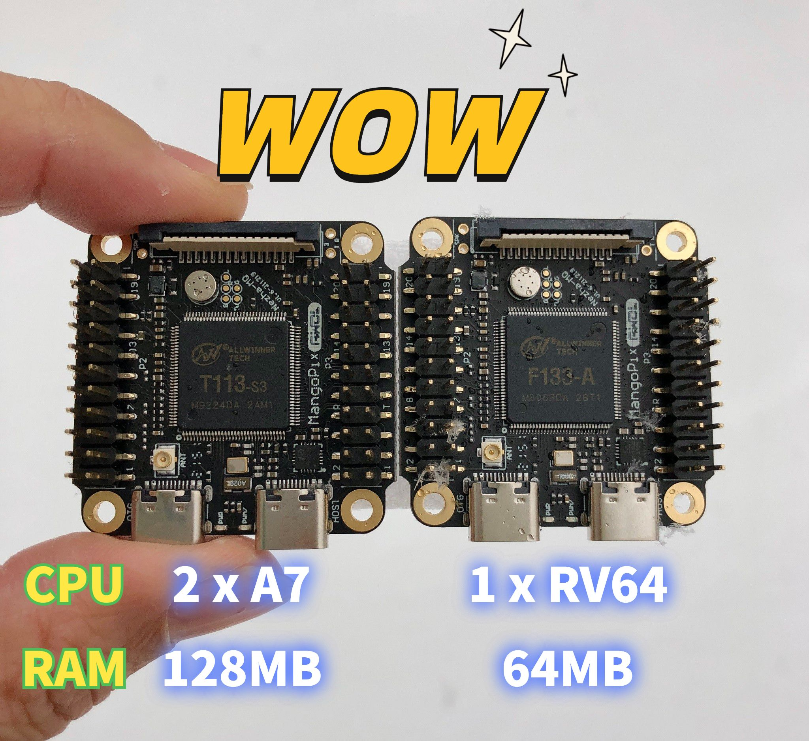

### MangoPi MQ-Dual

### Introduction

This micro development board is specially designed to run Linux. Despite a mini body, it has all the vital functions. Equipped with T113(A7 core) as the maincontroller chip, the board offers various commonly-used peripheral ports: GPIO, I2C & SPI, SDIO, Audio port(record, play), Video(RGB666 Display, touch, DVP, DSI and LVDS), USB Host, OTG, etc. Besides, the board comes with a built-in 64MB DDR and onboard WiFi, which fully supports Linux ecology and running complete Python.

### Spectification
  * T113 with 128MB DDR3, dual A7 up to 1GHz
  * Type-C USB-OTG and HOST
  * 22Pin expand x2(all pins out)
  * TF card
  * RTL8189F WiFi or other WiFi/BT module
  * FPC connector 15Pins DSI, 40Pins RGB, 24Pins DVP/RMII, 6Pins CTP
  * MIC and Audio OUT
  * Fel,reset button
  * 4x4cm size
  * Industrial level working temperature

